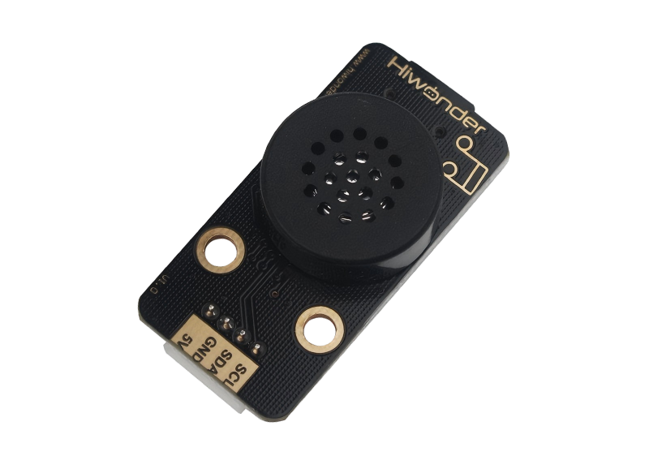
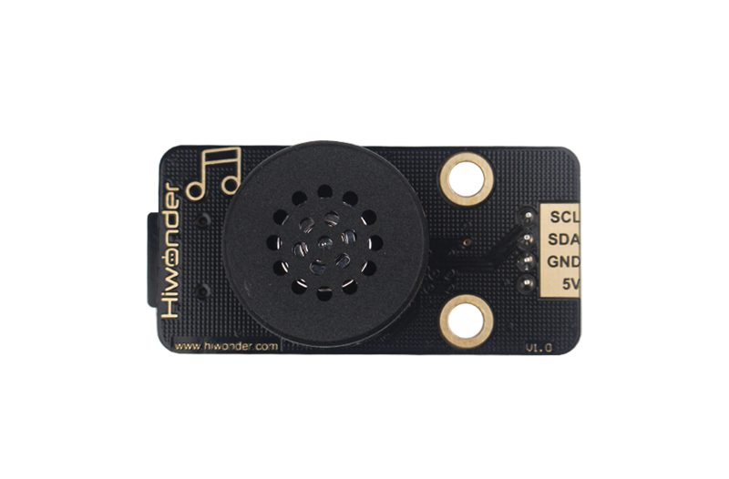
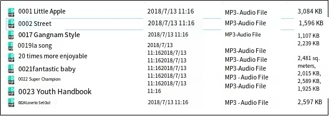

# 1. MP3 Module Instruction

## 1.1 MP3 Module Description

### 1.1.1 MP3 Module Introduction

This MP3 module plays music with simple commands. It features a 4-pin interface, supports hardware decoding for MP3, WAV, and WMA files, works with TF memory cards, and is compatible with FAT16 and FAT32 file systems.

### 1.1.2 Working Principle

It uses IIC communication and the DSP of the digital signal device to complete the task of processing transmission and decoding MP3 files. First, the main chip retrieves the MP3 audio file from memory and reads the signals stored in the memory to the decoding circuit for decoding. The analog audio signals are amplified, filtered through a low-pass filter, and output through the headphone jack, producing the music we hear.

## 1.2 Notice

1.  Do not exceed the rated voltage range during use.

2.  The MP3 module needs to be used with a TF card. The maximum memory supported by the TF card is 32G and it supports FAT16 and FAT32 file systems.

3.  Follow "[**1.4 File placement rules**](#anchor_1_4)" to set music file storage format, otherwise the files will not be recognized.

4.  The music supports storage of up to 3,000 tracks, and the module supports 30 levels of adjustable volume.

## 1.3 Pin Instruction

For detailed specifications and chip diagrams, you may refer to **"[MP3 Module Schematic](https://drive.google.com/drive/folders/1ZA2AW5js94n09_-81eO4HLDOB306F1Ss?usp=sharing)"**

| **Pin** | **Instruction** |
| :------ | :-------------- |
| 5V      | Power Input     |
| GND     | Ground          |
| SDA     | SDA Data Cable  |
| SCL     | SCL Clock Line  |

## 1.4 File Placement Rules

1.  Use a card reader to insert the TF card into any USB port on the computer.

2.  Create a new folder named "**MP3**" in the TF card.

3.  Place the songs you want in this folder. Use the following naming format: 0001 + song name. For example, the song "**Little Apple**" can be named 0001 Little Apple or simply 0001. You can also continue numbering the other songs in the same manner: 0010, 0100, 1000, and so on.

## 1.5 Project Outcome

You can refer to the case tutorials and programs for different platforms in the same directory as this tutorial. This section will demonstrate the testing effect using Arduino IDE as an example.

After the program is successfully uploaded, the MP3 module will automatically play the selected music.