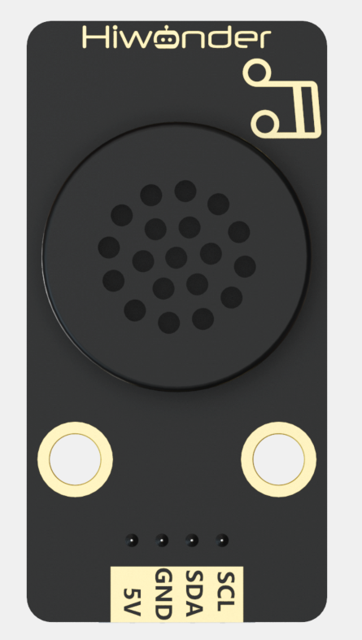
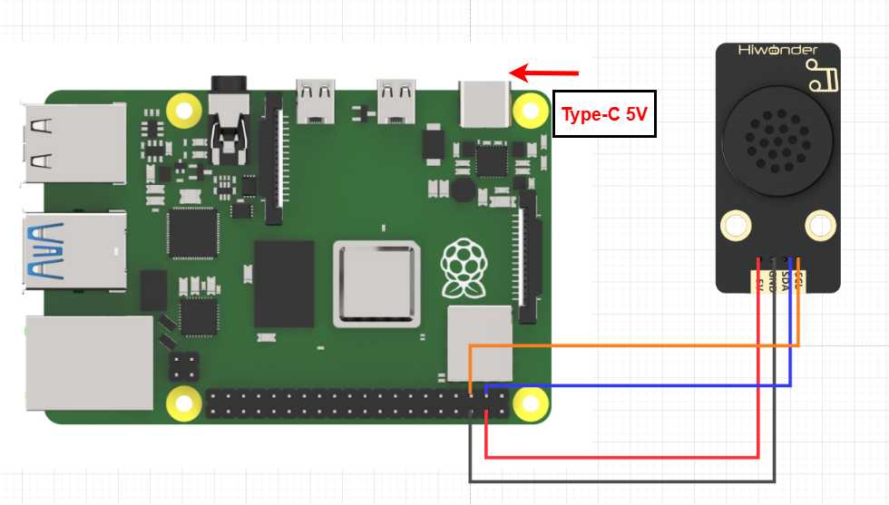

# 2. Raspberry Pi Development Tutorial



## 2.1 Getting Started

### 2.1.1 Wiring Instruction

When wiring the MP3 module, connect its 5V, GND, SDA, and SCL pins to the corresponding pins on the Raspberry Pi.



> [!NOTE]
>
> * When using Hiwonder's lithium battery, connect the battery cable with the red wire to the positive (+) terminal and the black wire to the negative (–) terminal of the DC port.
>
> * If the battery is not connected to the cables, do not connect the cable ends directly together. Doing so may cause a short circuit and damage the system.
>
> * Before powering on, ensure that no metal objects are touching the controller. Otherwise, the exposed pins at the bottom of the board may cause a short circuit and damage the controller.

### 2.1.2 Environment Configuration

Install NoMachine on your computer. The software package is located under "**[Appendix-> Remote Desktop Connection Tool](https://drive.google.com/drive/folders/1fPT8Rv4550TR0b_A6XEgt4Kk10eDRgGg?usp=sharing)"**. For the detailed operations of NoMachine, please refer to the same directory.

Drag the program library files into the Raspberry Pi system image. For demonstration purposes, the files are placed on the Desktop in this example. 

> [!NOTE]
>
> Make sure the library files are placed in the same directory as the program.

Open the terminal and enter the command to change to the program directory:

```bash
sudo chmod a+x MP3.py
```

## 2.2 Test Case

Program to play music.

### 2.2.1 Program Running

Open the terminal and enter the command to execute the program in this case: 

```bash
python3 MP3.py
```

### 2.2.2 Project Outcome

The MP3 module will first loop the preset song, switch to the next track after 20 seconds, play it for 2 seconds, then switch back to the previous track, and stop after 2 seconds.

### 2.2.3 Program Brief Analysis

- **Import Libraries**

```py
import smbus
import time
import numpy
```

Imported **subus**, **time** and **numpy** related function libraries,

`smbus`: A library for I2C communication, providing interfaces that facilitate communication with voice synthesis modules.

`time`: A library for time-related functions, useful for setting timers, calculating time differences, and more.

`numpy`: Mainly used for data calculation and processing.

- **Instantiate the MP3 class**

```py
class MP3:

    # Global Variables
    address = None
    bus = None

    MP3_PLAY_NUM_ADDR        = 1   # Play specific track (指定曲目播放), 0~3000, low byte first (低位在前)
    MP3_PLAY_ADDR            = 5   # Play (播放)
    MP3_PAUSE_ADDR           = 6   # Pause (暂停)
    MP3_PREV_ADDR            = 8   # Previous track (上一曲)
    MP3_NEXT_ADDR            = 9   # Next track (下一曲)
    MP3_VOL_VALUE_ADDR       = 12  # Set volume 0~30 (指定音量大小0~30)
    MP3_SINGLE_LOOP_ON_ADDR  = 13  # Enable single-track loop (开启单曲循环, 播放中有效)
    MP3_SINGLE_LOOP_OFF_ADDR = 14  # Disable single-track loop (关闭单曲循环)
```

This class defines several constants for using the MP3 module. For example, address and bus represent the MP3 player's I2C address and the SMBus bus used to communicate with the player.

`MP3_PLAY_NUM_ADDR`: Specifies the track number to play.

`MP3_PLAY_ADDR`: Plays the music.

`MP3_PAUSE_ADDR`: Pauses the music.

`MP3_PREV_ADDR`: Plays the previous track.

`MP3_NEXT_ADDR`: Plays the next track.

`MP3_VOL_VALUE_ADDR`: Sets the volume level.

`MP3_SINGLE_LOOP_ON_ADDR`: Enables single-track loop.

`MP3_SINGLE_LOOP_OFF_ADDR`: Disables single-track loop.

- **Control the MP3 Module via Class Functions**

```py
def __init__(self, address, bus=1):
        self.address = address
        self.bus = smbus.SMBus(bus)        
        
    def play(self):
        self.bus.write_byte(self.address, self.MP3_PLAY_ADDR)
        time.sleep(0.02)
        
    def pause(self):
        self.bus.write_byte(self.address, self.MP3_PAUSE_ADDR)
        time.sleep(0.02)
        
    def prev(self):
        self.bus.write_byte(self.address, self.MP3_PREV_ADDR)
        time.sleep(0.02)
        
    def next(self):
        self.bus.write_byte(self.address, self.MP3_NEXT_ADDR)
        time.sleep(0.02)
        
    def loopOn(self):
        self.bus.write_byte(self.address, self.MP3_SINGLE_LOOP_ON_ADDR)
        time.sleep(0.02)
        
    def loopOff(self):
        self.bus.write_byte(self.address, self.MP3_SINGLE_LOOP_OFF_ADDR)
        time.sleep(0.02)

    def playNum(self, num):
        self.bus.write_word_data(self.address, self.MP3_PLAY_NUM_ADDR, num)
        time.sleep(0.02)
        
    def volume(self, value):
        self.bus.write_word_data(self.address, self.MP3_VOL_VALUE_ADDR, value)
        time.sleep(0.02)
```

As shown above, the MP3 class also defines functions such as play, pause, prev, and next. These functions can be called in subsequent programs to control the MP3 module. The functions perform the following actions:

`play()`: Plays the music.

`pause()`: Pauses the music.

`prev()`: Plays the previous track.

`next()`: Plays the next track.

`loopOn()`: Enables single-track loop.

`loopOff()`: Disables single-track loop.

`playNum(num)`: Plays the track with the specified number.

`volume(value)`: Sets the volume level.

- **Control the MP3 Module via Class Functions**

```py
if __name__ == "__main__":
    addr = 0x7b # I2C address of the sensor (传感器IIC地址)
    mp3 = MP3(addr)
    mp3.volume(20) # Set volume to 20 before playback (设置音量为20，播放前设置)
    mp3.playNum(3) # Play track 3 (播放歌曲3)
    mp3.loopOn() # Enable single-track loop during playback (设置为单曲循环, 播放中设置)
    time.sleep(20) #Delay: Verify if it is in single-track loop mode. The delay time should be longer than the duration of the song.(延时，验证是否单曲循环中，延时时间应该大于歌曲时间长度)
    mp3.loopOff() #Disable loop, stops after current track finishes (关闭循环，播放完当前歌曲后停)
    mp3.volume(30) 
    mp3.play() # Play (播放)
    time.sleep(2)
    mp3.next() #switch to the next track(increment the track number)(切到下一首，即歌曲序号加1)
    time.sleep(2)
    mp3.prev() #switch to the previous track(decrement the track number) (切回上一首，即歌曲序号减1)
    time.sleep(2)
    mp3.pause()  # Pause (暂停)
```
  
In the main function, the address used by the MP3 module is first set to 0x7b; then the volume of the MP3 module and the song to be played are set.

Next, enable single-track loop mode. After playing for 20 seconds, disable the loop; if the song has not finished, it will continue playing until the end.

After that, set the MP3 volume to 30 and play the currently selected track. After 2 seconds, switch to the next track, then 2 seconds later switch back to the previous track, play for another 2 seconds, and then stop.