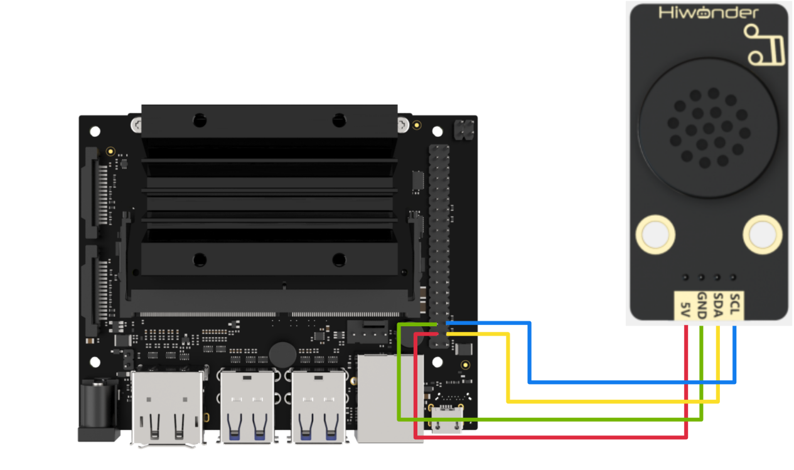

# 3. Jetson Development Tutorial


## 3.1 Getting Started

### 3.1.1 Wiring Instruction

This section uses DuPont wires to connect MP3 module. For wiring instructions, refer to the figure below:



> [!NOTE]
>
> **Note: Before powering on, ensure that no metal objects are touching the controller. Otherwise, the exposed pins at the bottom of the board may cause a short circuit and damage the controller.**

### 3.1.2 Environment Configuration

Install NoMachine on your computer. The software package is located under "**[2 Software Tools & Programs -\> 01 Software Installation Package -\> Remote Desktop Connection Tool]()"**. For detailed usage of NoMachine, refer to the materials in the same directory.

**Drag the program into the Jetson Nano system image, taking placing it on the desktop as an example.**

Open the terminal and enter the command to navigate to the program directory, enter:

```bash
cd Desktop/
```

## 3.2 Test Case

This case demonstrates how to plays music using the MP3 module.

### 3.2.1 Program Execution

Run the program by entering:

```bash
python3 MP3.py
```

### 3.2.2 Project Outcome

The MP3 module will first loop the preset song, switch to the next song after 20 seconds, switch back to the previous song after 2 seconds of playback, and then stop after another 2 seconds.

### 3.2.3 Program Brief Analysis

- **Import Libraries**

```py
# Example usage (使用例程)
import smbus2
import time
import numpy
```

Import the related libraries: smbus, time, and numpy.

**smbus:** A library used for I2C communication, providing an IIC interface for connecting and communicating with the speech synthesis module.

**time:** A library related to time functions, used for setting timers and calculating time intervals.

**numpy:** mainly used for data calculation and processing.

- **Instantiate An MP3 Class**

```py
class MP3:

    # Global Variables
    address = None
    bus = None

    MP3_PLAY_NUM_ADDR        = 1   # Play specific track (指定曲目播放), 0~3000, low byte first (低位在前)
    MP3_PLAY_ADDR            = 5   # Play (播放)
    MP3_PAUSE_ADDR           = 6   # Pause (暂停)
    MP3_PREV_ADDR            = 8   # Previous track (上一曲)
    MP3_NEXT_ADDR            = 9   # Next track (下一曲)
    MP3_VOL_VALUE_ADDR       = 12  # Set volume 0~30 (指定音量大小0~30)
    MP3_SINGLE_LOOP_ON_ADDR  = 13  # Enable single-track loop (开启单曲循环, 播放中有效)
    MP3_SINGLE_LOOP_OFF_ADDR = 14  # Disable single-track loop (关闭单曲循环)
```

This class defines some constants for using MP3. For example, address and bus represent the I2C address of the MP3 module and the smbus used for communication with the player.

`MP3_PLAY_NUM_ADDR`： Used to specify the number of the track to be played.

`MP3_PLAY_ADDR`：Used to play music.

`MP3_PAUSE_ADDR`： Used to pause music.

`MP3_PREV_ADDR`：Used to play the previous track.

`MP3_NEXT_ADDR`：Used to play the next track.

`MP3_VOL_VALUE_ADDR`： Used to set the volume level.

`MP3_SINGLE_LOOP_ON_ADDR`： Used to enable single-track repeat.

`MP3_SINGLE_LOOP_OFF_ADDR`： Used to disable single-track repeat.

- **MP3 Module Controller Class**

```py
def __init__(self, address, bus=1):
        self.address = address
        self.bus = smbus2.SMBus(bus)        
        
    def play(self):
        self.bus.write_byte(self.address, self.MP3_PLAY_ADDR)
        time.sleep(0.02)
        
    def pause(self):
        self.bus.write_byte(self.address, self.MP3_PAUSE_ADDR)
        time.sleep(0.02)
        
    def prev(self):
        self.bus.write_byte(self.address, self.MP3_PREV_ADDR)
        time.sleep(0.02)
        
    def next(self):
        self.bus.write_byte(self.address, self.MP3_NEXT_ADDR)
        time.sleep(0.02)
        
    def loopOn(self):
        self.bus.write_byte(self.address, self.MP3_SINGLE_LOOP_ON_ADDR)
        time.sleep(0.02)
        
    def loopOff(self):
        self.bus.write_byte(self.address, self.MP3_SINGLE_LOOP_OFF_ADDR)
        time.sleep(0.02)

    def playNum(self, num):
        self.bus.write_word_data(self.address, self.MP3_PLAY_NUM_ADDR, num)
        time.sleep(0.02)
        
    def volume(self, value):
        self.bus.write_word_data(self.address, self.MP3_VOL_VALUE_ADDR, value)
        time.sleep(0.02)
```

As shown in the above figure, this MP3 class also defines functions such as play, pause, prev, and next, which can be called in subsequent programs to control the MP3 module. The functions' descriptions can be referred to below:

`play()`: play music;

`pause()`: pause the music;

`prev()`: Play the previous track;

`next()`: Plays the next track;

`loopOn()`: Enable the single-track loop;

`loopOff()`: Disable the single-track loop;

`playNum(num)`: Play the music with a specified number;

`volume(value)`: Set the volume level.

- **MP3 Module Controller Class**

```py
if __name__ == "__main__":
    addr = 0x7b # I2C address of the sensor (传感器IIC地址)
    mp3 = MP3(addr)
    mp3.volume(10)  # Set volume to 10 before playback (设置音量为20，播放前设置)
    mp3.playNum(2) # Play track 2(播放歌曲2)
    mp3.loopOn() #Enable single-track loop during playback (设置为单曲循环, 播放中设置)
    time.sleep(20) #Delay: Verify if it is in single-track loop mode. The delay time should be longer than the duration of the song.(延时，验证是否单曲循环中，延时时间应该大于歌曲时间长度)
    mp3.loopOff() #Disable loop, stops after current track finishes (关闭循环，播放完当前歌曲后停)
    mp3.volume(10) 
    mp3.play() # Play (播放)
    time.sleep(2)
    mp3.next() #switch to the next track(increment the track number)(切到下一首，即歌曲序号加1)
    time.sleep(2)
    mp3.prev() #switch to the previous track(decrement the track number) (切回上一首，即歌曲序号减1)
    time.sleep(2)
    mp3.pause()  # Pause (暂停)
```

In the main function, first set the address used by the MP3 module to 0x7b. Then set the volume of the MP3 module and the songs to be played.

Next, enable single-track loop mode, play for 20 seconds, and then disable the loop. If the music has not finished, it will continue playing until the track ends.

Then set the MP3 volume to 30, play the currently selected track, and switch to the next track after two seconds. Switch back to the previous track after two seconds, play it for two seconds and then stop.